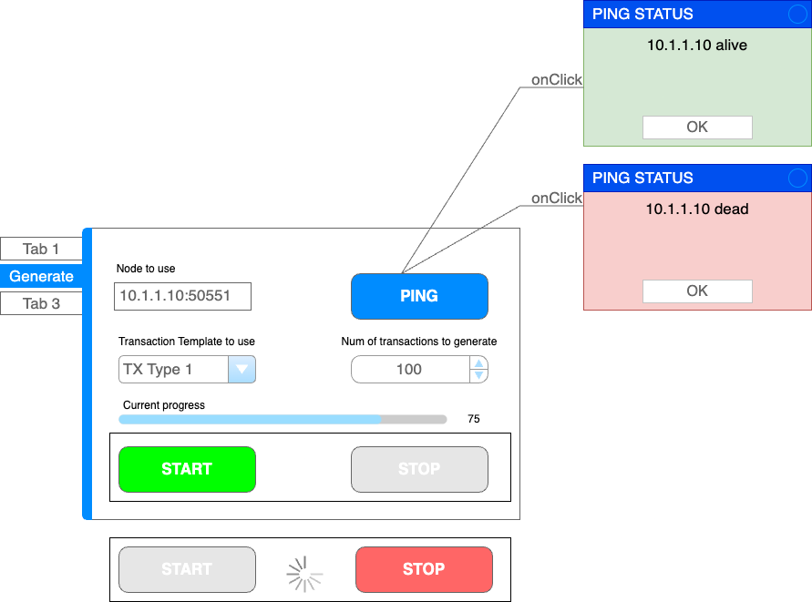

# PROJECT
```code
     _  __ ____  _____ _      _  _____  ____ 
    / |/ //  _ \/  __// \  /|/ \/__ __\/  _ \
    |   / | / \|| |  _| |\ ||| |  / \  | / \|
    |   \ | \_/|| |_//| | \||| |  | |  | |-||
    \_|\_\\____/\____\\_/  \|\_/  \_/  \_/ \|                                     
```
## TL;DR
### Bitcoin
_Bitcoin_ is a peer to peer electronic cash system created by Satoshi Nakamoto. It was first detailed in the Bitcoin Whitepaper in October 2008, and the source code was released in January 2009. The Bitcoin ledger and Blockchain were established with the generation of the Genesis block on the 3rd of January 2009 and the mining of Block 1 six days later on the 9th of January 2009.

Bitcoin allows electronic payments to be sent directly from one party to another, without requiring a central institution or server to process transactions and/or store funds.

The leaderless structure of the network is viewed as a resolution to The Byzantine Generals Problem allowing disconnected entities to follow a common direction without centralized instruction. This solves several issues previously seen as unsolvable in distributed networks, including the problem of preventing Double-spending of coins.

Bitcoin is primarily a payment system which supports peer to peer connection and Instant Transactions. Early in the History of Bitcoin payments required users to understand complicated technical details of Bitcoin's technological underpinnings to make transactions. But developments such as Paymail and Simplified Payment Verification are changing the landscape and making it much easier for users to connect and leverage the blockchain for the back-end of their applications.

Bitcoin also supports the development of application layer protocols which make use of Bitcoin Transactions as a transport layer for information exchange. Several Application layer protocols already exist for BitcoinSV - for more detail see Building on Bitcoin. The Metanet fuses Bitcoin's highly secure and instant sub-cent transactions with onchain data storage and transferability enabling efficient and secure web usage. This will bring forth an Internet of Value where Micropayments become a means to both access and monetize data.

Applications which make use of the immutable nature of the Bitcoin Ledger to store and retrieve data are emerging at an increasing rate. False Return scripts and other scripts that use Pushdata Opcodes to push data into Bitcoin transactions are creating new ways of recording data for public consumption. Bitcoin acts as a timestamp server allowing data to be validated and referenced using transactions.

I am introducing certain variations [Think of the Chaos Theory] to the bitcoin ledger allowing each node to maintain its own state of the truth on the ledger. This implementation should not differ too much from the original inmplementation execept for the parts that allow unlimited number of transactions to be processed and high volumes of blocks to be minted.

# LATEST UPDATE
Server nodes may run as locally so as in the cloud. Make sure the servers are reachable from outside. Consult your cloud provider for information how to enable external access.

# CURRENT WORK
1. ~~Add node configuration file to allow nodes to be fine tuned based on the needs and the current state of the network.~~ DONE
2. ~~Add gRPC service to allow a blockchain or dag component to interact with the node.~~ DONE
3. ~~Add transaction injection utility to test the gRPC service and test its performance* - Work in progress... [WASM, YEW, ACTIX-WEB]~~ - PARKED FOR NOW
4. Working defining transaction, block, and ledger structures, assembling transactions and blocks, building the ledger's DAG (unique order per node, not affecting the tx order in the Merkle tree)

# NOTE
As part of the latest task scope work, I have refactored the project structure by moving the p2p logic into crates/p2p and adding a web component in crates/web.


## DR;TL2
check out kognita https://github.com/quaisx/kognita
To see the log files: 
```bash
export RUST_LOG=info
```
To run server 1 on a local machine:
```bash
cargo run -- node-1 --grpc-port 50551 server --port 33331
```
To run server 2 on a local machine:
```bash
cargo run -- node-2 --grpc-port 50552 server --port 33332
```
To run client 1 on a local machine:
```bash
cargo run -- node-3 --grpc-port 50553 client --server_address /ip4/[machine ip]/udp/33331,/ip4/[machine ip]/udp/33332
```
To run client 2 on a local machine:
```bash
cargo run -- node-4 --grpc-port 50554 client --server_address /ip4/[machine ip]/udp/33331,/ip4/[machine ip]/udp/33332
```
Note: we do not specify the protocol as part of the address. The client will add ../quic-v1/
automatically as part of its connection establishment sequence.

We can test the gRPC service on node-2 by running grpcurl utility:
```bash
$ grpcurl  -plaintext -import-path ./proto -proto message.proto -d '{"message": "Kognita"}' localhost:50552 message.Message/Post
{
  "statusMessage": "request msg: Kognita"
}
```
You should also see a message similar to below in the server log:
```
gRPC Request Request {
    metadata: MetadataMap {
        headers: {
            "content-type": "application/grpc",
            "user-agent": "grpcurl/1.8.7 grpc-go/1.48.0",
            "te": "trailers",
        },
    },
    message: MessageRequest {
        message: "Kognita",
    },
    extensions: Extensions,
}
```
Now that gRPC basic message service is working, we can wire the code to inject the messages received via the gRPC service into the pubsub. I will do that next.

Nodes can run in two modes: __server__ and __client__

Server address must be in the format: /ip4/[ip4 address]/tcp/<port>

When the node runs in __server__ mode, it only listens for incoming connections from the client nodes. The server nodes are so called bootstrapping nodes.

When the node runs in __client__ mode, it initiates a connection to the server node. This connection allows the bootstrapping process to propagate the routing table information across the network so that the client node can efficiently participate in the network.

Majority of the nodes in the network will be __client__ nodes.
You will need to launch at least two nodes in separate terminal windows.
Observe the nodes start talking to each other by publishing and receiving psuedo random messages.


I will be adding support to enable nodes to communicate with each other over the network once I add support for DHT.

## Introduction
This is my attempt to write a crypto platform using my previous experience with a variety of crypto projects I have worked on in the past. I have used such programming languages as Python, Go, JavaScript and all these languages have their drawbacks. The biggest three problems I have faced while using these programming languages are:
1. Performance
2. Concurrency
3. Reliability

## Architecture


## Why RUST for a crypto project?
Well, I am not stepping into a phylosophical battle which programming language is the best overall. I am a beliver in choosing the right weapon for the right battle. And given my previous experience with crypto projects I think that Rust is an excellent choice for creating a crypto platform that would allow for blasting fast processing of high volumes of microtransactions. Think IoT. Think DAG. Think Markov Chain Monte Carlo. Cryptography. Multihashes. The list goes on...
The project uses WASM and YEW for the web based UI. 
All specifications and models are aligned with <a link="https://wiki.bitcoinsv.io/index.php/Main_Page">BitcointSV Wiki</a>


## Expectations and reality
Each node should be able to handle at least 1000+ microtransactions per second. A network of nodes should be able to handle an unlimited number of transactions per second. One of the biggest questions I have not answered yet - how to store such amounts of information about a high volume of transactions? If the network can handle an unlimited number of transactions, how will it store an infinite amount of data? Ambitions should have strong footing in reality. There is a lot of thinking ahead. 

## Current status
As of right now, this is work in progress. The work in experimental and I expect a lot of changes to the codebase in the near future. As of this writing - I am adding boilerplate code to have a basic node start up and exchange randomly generated transactions between nodes. 

## What has been learned so far?
One of the biggest challenges I have faced is the networking and tackling various networking topologies. I need to rethink transaction propogation approach as using libp2p pubsub has been somewhat desastrous. So, the main focus on the initial stages of development will be addressing the issues of connectivity. I need to build a solution that guarantees at least 90-95% success in establishing P2P connections. The rest - should and most likely will go through the relay servers.

### Special note on the use of relay servers
Since the soluton should be fully decentralized there should not be any centrally controlled infrastructure to facilitate the network. Hence, carefully chosen nodes should be elected by the network to provide such functionality in exchange for a reward. Which brings us to two important qeustions I will need to solve and address:
1. Motivation/Reward
2. Rating/Election

## Motivation/Reward
I will need to work out a viable and econimically sound motivation model which will allow all the participants contributing to the network to be compensated and rewarded. How? Gas fees? Is there another solution? Most likely. Especially when dealing with high volumes of transactions the reward mechanism needs to be carefully designed. Need to work on this problem in the background for now and do a lot of reading on crypto economy.

## Ratings/Elections
The network should be self gouverned and the nodes themselves must elect the nodes with the highest ratings to perform the most trustworthy operations, such as transaction validation. This model should be resistant to various exploits to prevent malicious nodes from taking over the network. The rating system should be fair and all nodes should have a chance to participate in activities that allow them to earn fair share of profits while participating on the network. 

## Fairness
All nodes must fairly assess other nodes' contributions to the network and vote on their ratings accordingly. The voting mechanism is being designed based on the best practices in this domain.

## Security
The system must be secure in a number of aspects to allow for secure transmission of the content as well as resistant to all known attacks.

## Scalability
The solution must be automatically scalable to allow for the growing load on the network. At this time, among other things, I am designing a backpressure mechanism to allow for the network to choose the right scaling option to properly distrube the load.

## Marketability
The solution must be attractable for the end users through such things as reward and various incetives; ease of use; community adoption and support; documentation; examples; practical use cases based on the current needs of the market.

## User Interface

... and many other topics.

## Testability and Proof of Specs
The solution must demonstrate the ability to test its functionality, speed, throughput and reliability through generating an authoriative report on test coverage, benchmarking, pique performance, resiliency, recovery, etc.

## Testing harness
The testing harness is the gateway into the node and network performance.
TBD: *

### Transaction generation
The test harness comes with a UI which allows for node discovery, connectivity, scheduling tasks (e.g. generating test transactions)

********************************



# Conclusion
Once again, this is work in progress. I do not expect this platform to be a viable candidate for replacing Ethereum or Bitcoin. That would be too ambisious of me, and, frankly, unachievable with the manpower/hours available to build such a network any time soon. But, as the saying goes - a thousand mile journey starts with a single step. The only goal I have determination to achieve is to become a better Rust architect/developer. 