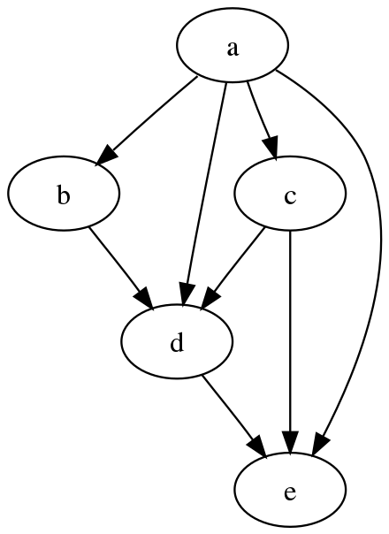
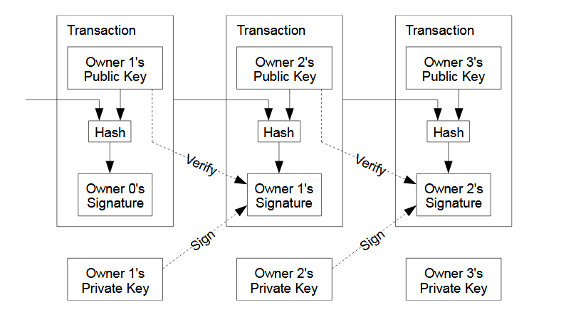
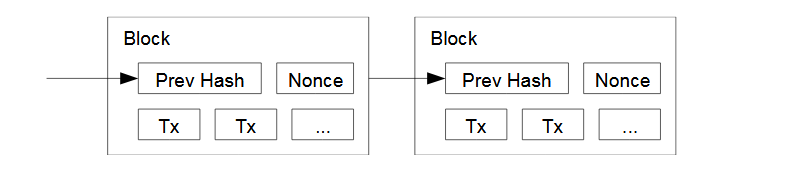

# The Ledger
The Bitcoin _ledger_ is a record of all valid transactions that have ever been transmitted to the network. The ledger is formed as a _Directed Acyclic Graph_ (__DAG__) where each transaction is a node. The graph starts at the _Coinbase_ transaction of the first block ever found and via chains of digital signatures maps out the entire history of valid exchange actions, allowing the tracing of all bitcoins back to their creation.
 

 
[https://en.wikipedia.org/wiki/Directed_acyclic_graph]
 
## Coinbase
_Coinbase_ is the special name given to the first transaction in every block. These can also be called 'Generation Transactions'.

The winning Miner creates this special transaction as part of the block templating process.

> A coinbase transaction follows the same format as a normal transaction, ___except___:
> It has exactly one txin.
> This txin's prevout hash is 0000...0000.
> This txin's prevout index is 0xFFFFFFFF.
> The txin's prevout script is an arbitrary byte array which has historically been used by 
> miners to signal identity and pass messages from block winning nodes to the rest of the 
> network.
>The sum of the values of all txout's cannot exceed the total of the Miner subsidy and the 
> mining fees paid by all other transactions included in the block.
[Source](https://wiki.bitcoinsv.io/index.php/Coinbase)
 
## Chain of Signatures

Valid transactions that are broadcast on The Bitcoin Network are committed to the ledger by miners in Blocks. A block consists of a header which contains a timestamp, a reference to the block it builds on, a valid Proof of Work and the double SHA-256 hash of the root of a Merkle tree generated with a list of transactions, and the list of transactions. Most nodes use compact block propagation techniques which compress the list of transactions to a much smaller size rather than broadcasting the full block. _Receiving Nodes must decompress the block using a list of validated transactions that they have also compacted._
[Source](https://wiki.bitcoinsv.io/index.php/Main_Page#The_Ledger)

## Mining

The ledger is held on a distributed network of nodes who use hash based Proof of Work to compete for the right to extend it and as a means to enforce network rules. The proof of work of each block in the longest chain of work is incorporated into its subsequent block to form the chain structure.

During the mining process, a node gathers transactions from the network on a first seen basis and evaluates whether they are profitable to mine before putting them into a block template. Block templates are created by calculating the root of a Merkle tree containing all of the transactions being mined. _The order of transactions in the Merkle tree is not related to their position in the transaction DAG_. As new transactions arrive, they are added to the tree, creating a new, updated template. Hash operators continuously request new block templates through the Getminingcandidate interface to ensure they are getting up-to-date block data to hash against. _A block is found when a miner successfully discovers a value that generates a hash less than the difficulty target_. The miner must then propagate the new block to the rest of the network who must then build an __additional 100 blocks on top of it before the winner can claim the block reward__.
[Source](https://wiki.bitcoinsv.io/index.php/Main_Page#The_Ledger)

