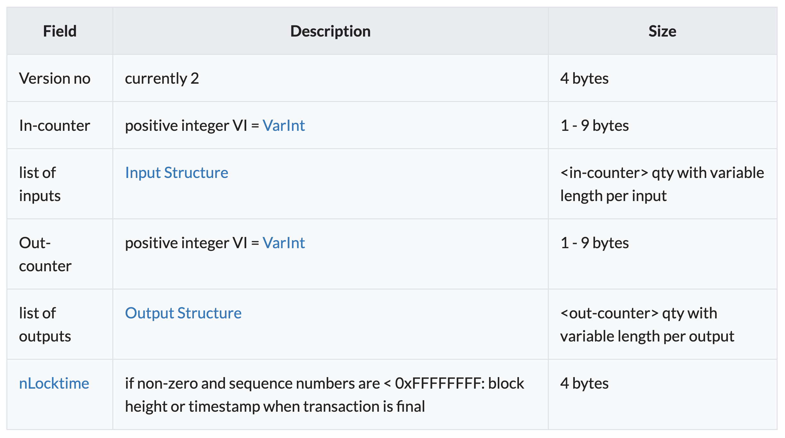
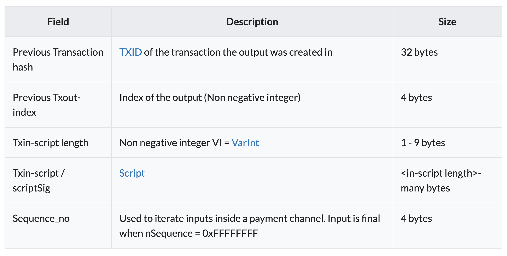
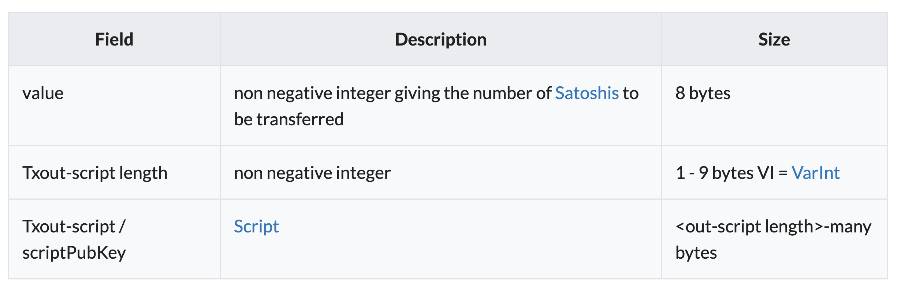

# General format of a Bitcoin transaction

The following outlines the elements that are serialized to build a valid Bitcoin transaction:


```
transaction:
{
    "inputs": [
        {
            "prevout_hash": "b8ed28aa87b92328e26a20553ac49fcb21e1f68daeb6cf7bcf4536e40503ffa8",
            "prevout_n": 0,
            "scriptSig": "4830450221008824eee04a2fbe62d2c3ee330eb2523b2c0188240714bb1d893aced1c454fa9a02202d32dbccc2af1c4b
                          830795f2fa8cd569a06ee70cb9d836bbd510f0b45a47711b4121028580686976c0e6a7e44a78387913e2d7508ff2344d
                          5f48669ba111dcd04170a8",
            "sequence": 4294967294,
        }
    ],
    "lockTime": 598793,
    "outputs": [
        {
            "scriptPubKey": "76a9146b0a9ed05da7223a1fe57e1a4d307556f7d6200788ac",
            "value": 1800
        },
        {
            "scriptPubKey": "76a914b993e512cb186f3f1c3f556a09716a1580eb99a188ac",
            "value": 90000
        }
    ],
}

serialized transaction: "0100000001a8ff0305e43645cf7bcfb6ae8df6e121cb9fc43a55206ae22823b987aa28edb8000000006b4830450221008824
                         eee04a2fbe62d2c3ee330eb2523b2c0188240714bb1d893aced1c454fa9a02202d32dbccc2af1c4b830795f2fa8cd569a06e
                         e70cb9d836bbd510f0b45a47711b4121028580686976c0e6a7e44a78387913e2d7508ff2344d5f48669ba111dcd04170a8fe
                         ffffff0208070000000000001976a9146b0a9ed05da7223a1fe57e1a4d307556f7d6200788ac905f0100000000001976a914
                         b993e512cb186f3f1c3f556a09716a1580eb99a188ac09230900" 

transaction id: "d8c5c42cbd1df7e48acab76fe05f2c9e612a20996fd37f4ffd4dc251385b6ba3" 

```


## Format of a Transaction Input
Otherwise known as a TXIN, the following table outlines the required elements of a valid transaction input:


### Inputs
An input is a reference to an output from a previous transaction, and a transactions can include between 1 and 232 inputs.

All of the new transaction's input value (that is, the total coin value of the previous outputs referenced by the new transaction's inputs) are added up, and the total (less any transaction_fees) is consumed by the outputs of the new transaction.

Previous tx is the TXID of a previous transaction.

Index is the specific output in the referenced transaction.

ScriptSig is the first half of a script which is provided when a UTXO is spent as an input to a transaction.

An input ScriptSig may contain many components. To redeem a P2PKH script the input must provide a public key and an ECDSA signature. The Public key is doubled hashed (First SHA-256 then RIPEMD-160) and the resultant hash must match the hash embedded in the ScriptPubKey of the output being redeemed.

The public key is then used to verify the redeemer's signature. Dependent on the SIGHASH flags used, the signature may cover a hash representing part or all of the transaction. Combined with the public key, this proves the transaction was created by a person or process that controls the keys needed to spend the bitcoin in the input.

### TXID
A Transaction ID or _TXID_ is the __double__ _SHA256 hash_ or _SHA256d_ of a _serialized_ Bitcoin transaction. TXIDs are not part of the transaction, as the hash cannot be generated until the transaction is complete. A TXID and VOUT (or prevout_n) index are used to reference UTXOs when they are added to a transaction as an input.

The double SHA256 hash enables network participants to identify and communicate transactions efficiently. They are used at all levels of the ecosystem, including wallets and block explorers.

Transaction IDs are used extensively in the peer-to-peer protocol. For example, peers on the network synchronise their transaction database using a 3 message sequence. A node will send out an inv message containing one or more transaction IDs. In the case that the receiving node/peer does not have a copy of the full transaction, he can respond with a gettransaction message containing the transaction ID. This is responded to with a tx message containing the full serialised transaction. Using transaction IDs to broadcast transaction database information, greatly reduces the volume of data that has to be sent over the network.

The double hash property can be used in another interesting way. The user can know that a corresponding party has a copy of the full TX by requesting the intermediate hash, which can only be generated by hashing the full transaction. This 'proof of possession' is present across Bitcoin and enables complex functionality and checking of resources when Bitcoin is being used in a fully peer to peer environment.
[Source](https://wiki.bitcoinsv.io/index.php/TXID)

## Format of Transaction Output
Otherwise known as a TXOUT, the following table outlines the required elements of a valid transaction output:

The output's scriptPubKey sets the conditions to release this bitcoin amount later. The sum of the output values of the first transaction is the value of the mined bitcoins for the block plus possible transactions fees of the other transactions in the block.

## OUTPUTS
An output contains a piece of Bitcoin Script which can be used to lock bitcoins, requiring a certain set of keys or information to be provided to unlock them. Outputs can also be used to inscribe data onto the ledger.

This ScriptPubKey is the second half of a full script and is only completed when the output is spent. There can be more than one output, and they share the combined value of the inputs. The Value of each output is the number of Satoshis that the script unlocks when solved. Because each output from one transaction can only ever be referenced once by an input of a subsequent transaction, the entire value of the combined inputs needs to be allocated to the transaction outputs. Any Satoshis left unallocated are considered to be paid in mining fees and are awarded to the miner whose node generates the block that the transaction is included in.

If a user's input is larger than the value they want to send, the transaction must create at least two outputs, one sending the required funds to the destination, and one sending the change back to the user.

Outputs can have a value of zero satoshis. Currently, these outputs are limited to False Return scripts and are typically used to carry other information or tokens for Application layer protocols.

### Satoshis

A satoshi is the smallest division of a bitcoin and the base unit of exchange on the Bitcoin SV network. There are 100,000,000 satoshis in 1 bitcoin. The unit is named after Satoshi Nakamoto, the author of the 2008 Bitcoin whitepaper.

Satoshis are represented as integers where 1 satoshi is the smallest unit of exchange on the Bitcoin ledger.

"Bitcoins" are a human construct, as all values in Bitcoin are treated as integer quantities of satoshis, rather than decimal bitcoin fractions in the protocol.

#### Satoshis and the Miner Subsidy Schedule
The total number of satoshis in existence is approximately 2.1 x 1015 (21 million BSV), and they are distributed at a mathematically predictable rate using the Miner subsidy formula. The miner subsidy, which began at 50 newly minted bitcoins per block, is scheduled to divide in 2 every 210,000 blocks, approximately every 4 years. At the time of the 6th halvening (approximately 2032) the Miner subsidy will fall below 1 BSV to 78125000 satoshis (0.78125 BSV).

By the time of the 31st halvening (approximately the year 2136) the Miner subsidy will be reduced to 1 satoshi and in the year 2140 (block no. 6,720,000) the subsidy will finish marking the final distribution of satoshi tokens onto the ledger.

### Opcodes used in Bitcoin Script
This is a list of all Script words, also known as opcodes, commands, or functions.

OP_NOP1-OP_NOP10 were originally set aside to be used when HASH and other security functions become insecure due to improvements in computing.

False is zero or negative zero (using any number of bytes) or an empty array, and True is anything else. [[Source]](https://wiki.bitcoinsv.io/index.php/Opcodes_used_in_Bitcoin_Script)

