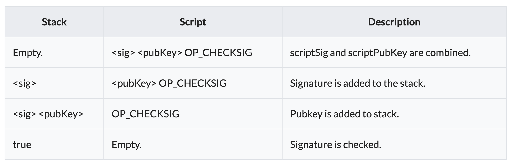
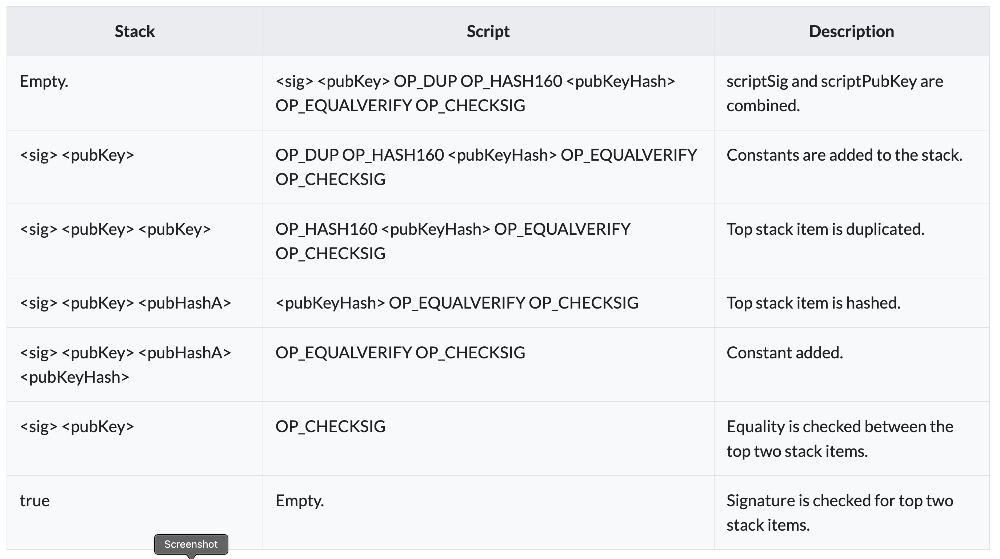

# Transaction Validation
To verify that inputs are authorized to collect the values of referenced outputs, Bitcoin uses a Forth-like scripting system. The input's scriptSig and the referenced output's scriptPubKey are evaluated (in that order), with scriptPubKey using the values left on the stack by the scriptSig. The input is authorized if scriptPubKey returns true. Through the scripting system, the sender can create very complex conditions that must be met in order to claim the output's value.

For example, it's possible to create an output that can be claimed by anyone without any authorization. It's also possible to require that an input be signed by ten different keys or be redeemable with a password instead of a key.

## Puzzles and Solutions
The flexible scripting language enabled by the Bitcoin protocol allows a multitude of different transaction types to be created. Each scriptSig/scriptPubKey pair is validated by the network miners and mined into a block if the script returns true. Some commonly used Bitcoin puzzle types are described below:

### Pay to Public Key (P2PK)
scriptPubKey: <pubKey> OP_CHECKSIG scriptSig: <sig>

When redeeming coins that have been sent to a Bitcoin public key the script validates that the provided signature was generated by the private key that also corresponds to the public key.

Checking process:



### Pay to Public Key Hash (P2PKH)
```
scriptPubKey: OP_DUP OP_HASH160 <pubKeyHash> OP_EQUALVERIFY OP_CHECKSIG
scriptSig: <sig> <pubKey>
```

A Bitcoin address is only a hash, so the sender can't provide a full public key in scriptPubKey. When redeeming coins that have been sent to a Bitcoin address, the recipient provides both the signature and the public key. The script verifies that the provided public key does hash to the hash in scriptPubKey, and then it also checks the signature against the public key.

Checking process:
