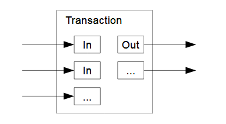

# Transactions
All Bitcoin Transactions are payments of some kind. Transactions are written in a flexible scripting language that is used to assign custodial control to each transaction output via the creation of arbitrary spending conditions defined by scripts.

Each transaction uses bitcoins stored in __unspent transaction outputs__ as the transaction inputs. The transaction process aggregates the _satoshis_ held in each input and spends them into a new set of _unspent transaction outputs_. When __UTXOs__ are spent in a transaction they are consumed.
 

## Bitcoin Scripting Langauge
The Bitcoin scripting language is [_Turing complete_](https://en.wikipedia.org/wiki/Turing_completeness), and can be used to create [_Turing machines_](https://en.wikipedia.org/wiki/Turing_machine) that use the Bitcoin ledger as a tape, writing to and reading from the transaction graph as needed.

The scripting language also includes _opcodes_ that allow users to embed arbitrary data in transactions, providing for the creation of application layer protocols that use Bitcoin transactions as a transport layer.

Rewards paid to miners for the creation of a block are inscribed in what is called a Coinbase transaction. This transaction has a specific format and is always the first transaction in the block's Merkle tree.
